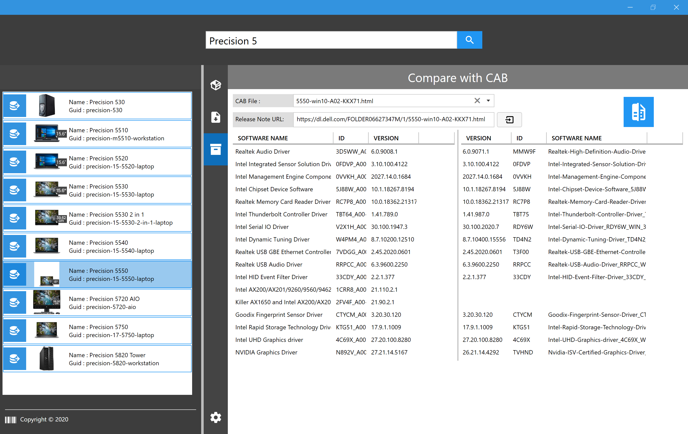

##  Driver Downloader Tool

Donwload drivers from vendor website (This is not for downloading CAB File but drivers components).
/!\ There is no proxy support yet. 


## Usage


### Drivers Selection

How to find a computer model and select drivers associated?

```
Start the script, select your vendor (DELL, LENOVO and HP only supported so far).
Enter a model ( example: X1 Carbon ) and click Search (Enter is not working yet ...)
Select the Model you want (Don't forget to click on the load button!)
Browse inside each section and check what you want to download. 
```


### Drivers Download and Extract

How to download 

```
Click on 'View' to get what you selected in Selection Pane.
Select a working directory (everything will be stored inside a folder with device model name (Example: Thinkpad T480) )
Click on 'Download' Button and wait for it to complete ... (HP download takes little time to start off)
```

How to Extract (Optional)

```
After perfoming steps above: Click on 'Extract'
It will Extract the content of each drivers in Download folder 
```


### CAB File comparator

The purpose of this option is to compare version between CAB driver files and the model selected.
This is based on a string comparison. Results are not 100% accurate.



* If you have selected a computer and a release note is detected, you can load it directly. (Not available for HP)
```
Select the CAB (There is always one for Windows and one for WinPE)
Load the CAB with the load button (It will extract relevant infirmation)
Clik on Compare
```

* If you have selected a computer and want to compare against another CAB
```
Go grab the release note URL. For example:
HP:     use cva link  (https://ftp.hp.com/../spxxxx.cva)"
Dell:   use html link (https://dl.dell.com/.../xx-win10-A0xx.html)"
Lenovo: use txt link  (https://download.lenovo.com/.../tp_xxx.txt)"

And continue with steps above.
```


## License

Distributed under the MIT License. See `LICENSE` for more information.
